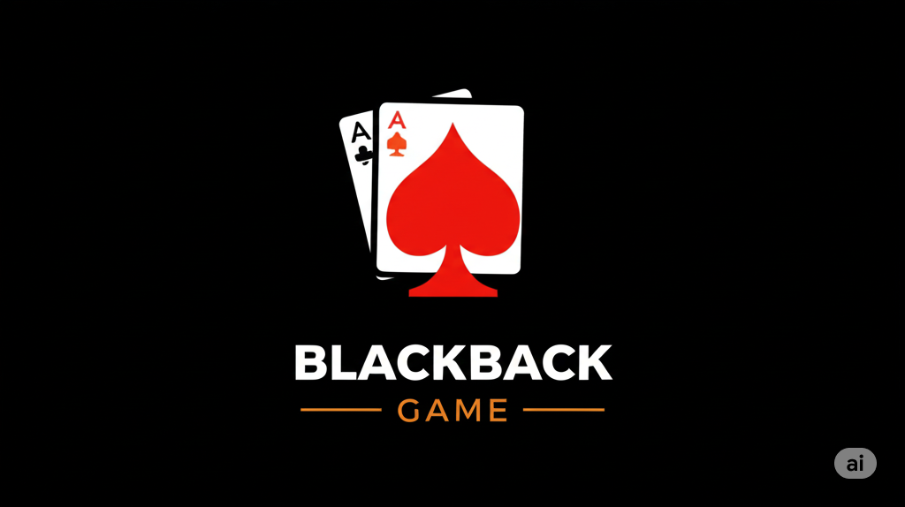

# 🃏 Python Blackjack Game



A stunning console-based Blackjack game built in Python featuring beautiful ASCII art, intuitive gameplay mechanics, and comprehensive statistics tracking. Experience the classic casino game with elegant visual design and smooth user interaction.

<section align="center">
   <span>
      
   </span>
   <span>
      
    </span>
   <span>
      
    </span>
    <span>
        
    </span>
    <span>
      
    </span>
    <span>
      
    </span>
</section>

## 📁 Project Structure

```
blackjack-by-python/
├── main.py         # Main entry point with ASCII title
├── game_logic.py   # Core game logic and BlackjackGame class
├── entities.py     # Card, Deck, Player, and Dealer classes
└── README.md       # This documentation
```

## 🚀 How to Run

1. **Clone or download** this repository
2. **Navigate** to the project directory
3. **Run** the game:
   ```bash
   python main.py
   ```

### Requirements
- Python 3.6 or higher
- No external dependencies required (uses only built-in libraries)

## 🎯 How to Play

### Game Rules
- Get as close to **21** as possible without going over
- **Face cards** (J, Q, K) = 10 points
- **Aces** = 1 or 11 points (automatically optimized)
- **Number cards** = face value (2-10)

### Gameplay
1. You and the dealer each get 2 cards initially
2. One dealer card is hidden (face-down)
3. **Your turn:**
   - Type `h` or `hit` to draw another card
   - Type `s` or `stand` to keep your current hand
4. **Dealer's turn:**
   - Dealer must hit if score < 17
   - Dealer must stand if score ≥ 17
5. **Winning conditions:**
   - Beat dealer's score without going over 21
   - Dealer busts (goes over 21)
   - Get natural Blackjack (21 with first 2 cards)

### Game Controls
- `h` or `hit` - Draw another card
- `s` or `stand` - Keep current hand and end turn
- `y` or `yes` - Play another round
- `n` or `no` - End game and see statistics
- `Ctrl+C` - Emergency exit

## 🏆 Winning Scenarios

| Scenario                    | Result                          |
| --------------------------- | ------------------------------- |
| Your score > 21             | **BUST** - You lose             |
| Dealer score > 21           | **Dealer BUST** - You win       |
| Your score = 21 (2 cards)   | **BLACKJACK** - You win         |
| Dealer score = 21 (2 cards) | **Dealer BLACKJACK** - You lose |
| Your score > Dealer score   | **WIN** - Higher score          |
| Dealer score > Your score   | **LOSE** - Lower score          |
| Same score                  | **TIE** - Push/Draw             |

## 📊 Statistics

The game tracks:
- **Total wins** - Number of rounds you won
- **Total losses** - Number of rounds dealer won  
- **Total ties** - Number of tie/push games
- **Win rate** - Your winning percentage

Example output:
```
📋 Final Statistics:
Your wins: 7
Dealer wins: 5
Ties: 2
Your win rate: 50.0%
```

## 🎨 Sample Gameplay

```
========================================================================
██████╗ ██╗      █████╗ ██   ██╗██╗  ██╗██╗      █████╗  ██████╗██╗  ██╗
██╔══██╗██║     ██╔══██╗███  ██║██║ ██╔╝██║     ██╔══██╗██╔════╝██║ ██╔╝
██████╔╝██║     ███████║███████║█████╔╝ ██║     ███████║██║     █████╔╝
██╔══██╗██║     ██╔══██║██╔═███║██╔═██╗ ██   ██║██╔══██║██║     ██╔═██╗
██████╔╝███████╗██║  ██║██║  ██║██║  ██╗╚█████╔╝██║  ██║╚██████╗██║  ██╗
╚═════╝ ╚══════╝╚═╝  ╚═╝╚═╝  ╚═╝╚═╝  ╚═╝ ╚════╝ ╚═╝  ╚═╝ ╚═════╝╚═╝  ╚═╝
========================================================================

🎮 Starting new round...
=======================================

🃏 Player's hand:
  King of Hearts
  7 of Diamonds
  Score: 17

🃏 Dealer's hand:
  Ace of Spades
  [Hidden Card]
---------------------------------------

Do you want to (h)it or (s)tand? s

You chose to stand with 17

🤖 Dealer's turn:
🃏 Dealer's hand:
  Ace of Spades
  6 of Clubs
  Score: 17

Dealer stands with 17

=======================================
🎯 FINAL RESULTS
=======================================
🟡 It's a TIE! Same score.

🏅 Score: You: 0 | Dealer: 0 | Ties: 1
```

## 🔧 Code Architecture

### Classes Overview

#### `Card` Class (entities.py)
- Represents a single playing card
- Handles Blackjack value calculation
- Properties: suit, rank, value

#### `Deck` Class (entities.py)
- Manages a 52-card deck
- Provides shuffle and deal functionality
- Automatically removes dealt cards

#### `Player` Class (entities.py)
- Base class for player and dealer
- Manages hand, score, and basic actions
- Methods: hit, stand, add_card, reset_hand

#### `Dealer` Class (entities.py)
- Extends Player class
- Handles hidden card functionality
- Special dealer-specific methods

#### `BlackjackGame` Class (game_logic.py)
- Main game engine
- Handles complete game flow
- Methods: calculate_score, player_turn, dealer_turn, etc.

## 🚫 Known Limitations

- Console-based interface only
- Single player vs dealer only
- No betting/money system
- No card splitting or doubling down
- No insurance bets

---

This comprehensive documentation was generated with the assistance of **GitHub Copilot**, showcasing AI-powered development workflow and intelligent code documentation.